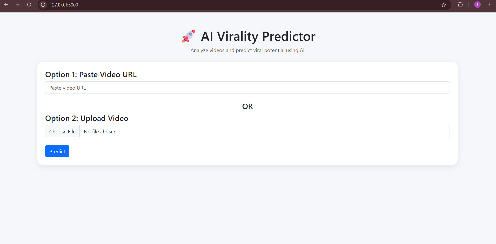
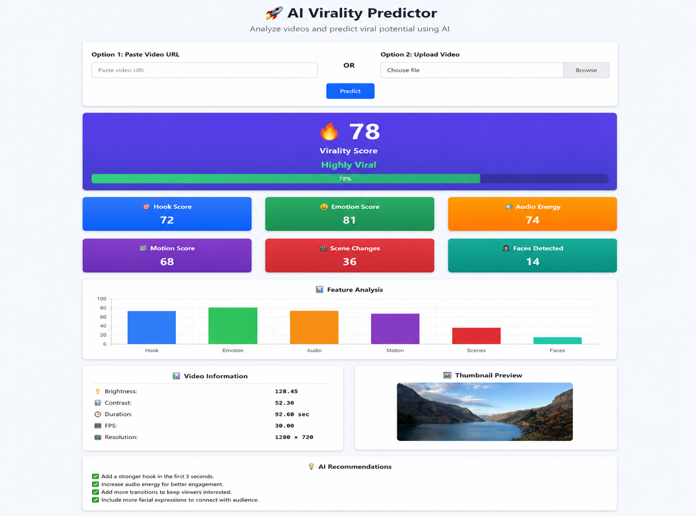

# AI Virality Predictor 🚀

An AI-powered video analysis system that predicts the viral potential of videos using **Machine Learning** and **Computer Vision**. The system analyzes video characteristics, extracts meaningful features, and generates a virality prediction score through a machine learning pipeline.

---

## Features

- 🎥 Video upload-based analysis
- 🔗 YouTube URL-based video analysis
- 📊 Automatic video metadata extraction
- 👁️ Computer vision-based feature extraction using OpenCV
- 🤖 ML-based virality prediction
- 📈 Video statistics analysis
- 🖼️ Thumbnail extraction
- ⚡ Flask-based web application interface

---

## Workflow

```
Video Input
     ↓
Video Processing & Feature Extraction
     ↓
Computer Vision Analysis (OpenCV)
     ↓
Machine Learning Model
     ↓
Virality Prediction Score
```

---

## Tech Stack

### Backend
- Python
- Flask

### Machine Learning
- Scikit-learn
- XGBoost
- TensorFlow

### Computer Vision
- OpenCV

### Video Processing
- yt-dlp

### Frontend
- HTML
- CSS

---

## Features Extracted

The system analyzes multiple video characteristics including:

- Duration
- FPS
- Resolution
- Brightness
- Contrast
- Motion score
- Scene changes
- Face detection
- Thumbnail information
- Engagement-related metadata

---

## Machine Learning Pipeline

The prediction pipeline includes:

- Data preprocessing
- Feature extraction
- Feature engineering
- Model training
- Model evaluation
- Virality prediction

Models explored:

- XGBoost
- Random Forest
- Ridge Regression
- Gradient Boosting

---

## Model Performance

Evaluation results:

- Test R² Score: **~0.78**
- Cross Validation MAE: **~3.48**

The final model predicts the potential viral score of a video based on extracted visual and metadata features.

---

## Project Structure

```
AI-Virality-Predictor/
│
├── app.py                    # Flask application
├── video_analyzer.py         # Video feature extraction module
│
├── ml_model/
│   ├── predict.py            # Model inference
│   └── model files
│
├── templates/
│   └── HTML templates
│
├── static/
│   └── CSS, images, assets
│
├── requirements.txt
├── README.md
└── .gitignore
```

---

## How to Run

### 1. Clone the repository

```bash
git clone https://github.com/Satyanshi08/AI-Virality-Predictor.git
```

### 2. Navigate to the project directory

```bash
cd AI-Virality-Predictor
```

### 3. Create and activate virtual environment

For Windows:

```bash
python -m venv venv
```

Activate:

```bash
venv\Scripts\activate
```

### 4. Install dependencies

```bash
pip install -r requirements.txt
```

### 5. Run the application

```bash
python app.py
```

### 6. Open in browser

```
http://127.0.0.1:5000
```

---

## Application Screenshots

(Add screenshots here)

Example:

```



```

---

## Future Improvements

- Support for multiple social media platforms
- Audio analysis for videos
- Comment sentiment analysis
- Deep learning-based video understanding
- Real-time virality forecasting
- Advanced visualization dashboard

---

## Authors

**Satyanshi Pandey**  
**Angel Mishra**  
**Anushka**

AI/ML Enthusiasts | Computer Vision | Machine Learning